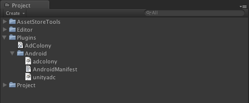

AdColonyの設定は非常に簡単です。
ダウンロードしたAdColony pluginには、以下のファイルが含まれています：
* `AdColony.cs`
* `unityadc.jar`
* `adcolony.jar`
* `AndroidManifest.xml` (Unity4.2.x以下用)
* `AndroidManifest_Unity43.xml` (Unity 4.3.x以上の場合、このファイル名を`AndroidManifest.xml`に変更した上で、ご利用ください。)

##Unity Android プロジェクトの設定##
AdColony Unity pluginの設定には、以下のファイルが必要です:
* こちらのファイルをUnityプロジェクトの `Plugins/` フォルダに置いてください：
  * `AdColony.cs`
* こちらのファイルをUnityプロジェクトの `Plugins/Android/`  フォルダに置いてください：
  * `unityadc.jar`
  * `adcolony.jar`
  * `AndroidManifest.xml` (Unity4.2.x以下用)
  * `AndroidManifest_Unity43.xml` (Unity 4.3.x以上の場合、このファイル名を`AndroidManifest.xml`に変更した上で、使ってください)

プロジェクトフォルダは、次のようになります。  

##AndroidManifest.xmlのカスタム##
AdColony pluginの下のAndroidManifest.xmlを利用しないの場合、以下のAdColonyバージョンを参照し、**三つのpermissions** と **三つのactivity specifications**が含まれてるか確認してください：

<pre>
    &lt;?xml version="1.0" encoding="utf-8"?&gt;

    &lt;manifest xmlns:android="http://schemas.android.com/apk/res/android"
        package="com.jirbo.unitytest"
        android:versionCode="1"
        android:versionName="1.0"&gt;
      &lt;!-- TODO: Replace the 'package' value above to reflect your app's package id. --&gt;

      &lt;!-- NOTE: Adjust minSDKVersion and targetSdkVersion as desired. --&gt;
      &lt;uses-sdk android:minSdkVersion="10" android:targetSdkVersion="19" /&gt;

      <b>&lt;!-- NOTE: You must have at least these three permissions for AdColony. --&gt;
      &lt;uses-permission android:name="android.permission.INTERNET" /&gt;
      &lt;uses-permission android:name="android.permission.WRITE_EXTERNAL_STORAGE" /&gt;
      &lt;uses-permission android:name="android.permission.ACCESS_NETWORK_STATE" /&gt;</b>

      &lt;application android:label="@string/app_name" android:icon="@drawable/app_icon" android:hardwareAccelerated="true"&gt;
        &lt;activity android:name="com.unity3d.player.UnityPlayerNativeActivity"
            android:configChanges="keyboardHidden|orientation|screenSize"
            android:label="@string/app_name"&gt;

          &lt;intent-filter&gt;
            &lt;action android:name="android.intent.action.MAIN" /&gt;
            &lt;category android:name="android.intent.category.LAUNCHER" /&gt;
          &lt;/intent-filter&gt;

          &lt;!-- &lt;meta-data android:name="unityplayer.UnityActivity" android:value="true" /&gt; --&gt;
          &lt;meta-data android:name="unityplayer.ForwardNativeEventsToDalvik" android:value="true" /&gt;

        &lt;/activity&gt;

        <b>&lt;!-- NOTE: You must include these three activity specifications for AdColony. --&gt;
        &lt;activity android:name="com.jirbo.adcolony.AdColonyOverlay"
            android:configChanges="keyboardHidden|orientation|screenSize"
            android:theme="@android:style/Theme.Translucent.NoTitleBar.Fullscreen" /&gt;

        &lt;activity android:name="com.jirbo.adcolony.AdColonyFullscreen"
            android:configChanges="keyboardHidden|orientation|screenSize"
            android:theme="@android:style/Theme.Black.NoTitleBar.Fullscreen" /&gt;

        &lt;activity android:name="com.jirbo.adcolony.AdColonyBrowser"
            android:configChanges="keyboardHidden|orientation|screenSize"
            android:theme="@android:style/Theme.Black.NoTitleBar.Fullscreen" /&gt;</b>
      &lt;/application&gt;
    &lt;/manifest&gt;
</pre>

####注意：GoogleのAdvertising IDを取得するため、プロジェクトの中にGoogle Play Services 4.0+ を追加してください。####
Google Advertising ID はAdColony広告キャンペーンのほぼ全てにおいて必要とされるデバイス ID です。もし Google Advertising ID が有効でないと、`フィルレート`に影響が及ぶ可能性があります。  
詳細についてはここをチェックをしてください:  
http://developer.android.com/intl/ja/google/play-services/setup.html

##次のステップ##
AdColony Unity pluginは、UnityのゲームやアプリでAdColonyを使用することができる方法を示すサンプルアプリケーションが含まれています。 [Showing Interstitial Videos](Showing-Interstitial-Videos.md)はinterstitial動画を再生する機能について説明します。 [Showing V4VC Videos](Showing-V4VC-Videos.md)はV4VCの使用方法について説明します。なお、[API Details](API-Details.md)は全てAPIを参照することができます。

##トラブルシューティング##
* **Unity 4.3.x**以上を利用してる方で、もしアプリを実行するときに空白画面が表示された場合、`AndroidManifest_Unity43.xml`が`AndroidManifest.xml`に置き換えられているかを確認してください。
* **Unity 4.3.x**以上を利用してる方で、もしアプリを実行するときに、どこをタップをしても何も反応がない場合、`ForwardNativeEventsToDalvik`の設定が必要となります、`AndroidManifest_Unity43.xml`を参照してください。
