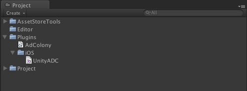

##Xcode プロジェクトの環境設定
AdColonyの実装はXcodeの設定が幾つか必要となります。

以下のファイルでパッケージされたAdColony Unity pluginで、必要なビルドと手動環境設定は:
* こちらのファイルをUnityプロジェクトの　`Plugins/`　フォルダに置いてください
  * `AdColony.cs`
* こちらのファイルをUnityプロジェクトの　`Plugins/iOS/` フォルダに置いてください
  * `UnityADC.mm`

プロジェクトフォルダは、次のようになります。  


iOSプロジェクトを作る、生成されたXcodeプロジェクトを任意の場所に保存し、Xcodeでプロジェクトを開きます。

`AdColony.framework`　をXcode プロジェクトにコピーし、 AdColonyにリンクする全てのターゲットに追加します。

 **Target > Build Settings > Architectures** を開き、Xcode プロジェクトが バージョン 6.0　以上の Base SDK を使っていることを確認してください。また、 `armv6` アーキテクチャーを使っていないことを確認してください。

 

 **Target > Build Phases > Link Binary With Libraries**　に以下のライブラリとフレームワークを追加します。
* `libz.1.2.5.dylib`
* `AdColony.framework`
* `AdSupport.framework`  (Set to Optional)
* `CoreTelephony.framework`
* `EventKit.framework`
* `MessageUI.framework`
* `Social.framework`  (Set to Optional)
* `StoreKit.framework`  (Set to Optional)
* `Webkit.framework` (Set to Optional)

もし、Unity が自動で追加されない場合は、 以下のフレームワークを追加してください。
* `AudioToolbox.framework`
* `AVFoundation.framework`
* `CoreGraphics.framework`
* `CoreMedia.framework`
* `EventKitUI.framework`
* `MediaPlayer.framework`
* `QuartzCore.framework`
* `SystemConfiguration.framework`


最後に、`-ObjC` と `-fobjc-arc` フラグが、`Build Settings` 中の `Other Linker Flags`下のサブセッションにある *Debug*  と *Release* の両方に追加されたことを確認してください。

**Note for Unity 5:** Xcodeプロジェクトをビルドするときに、`-fno-objc-arc` フラグをUnityADC.mmのbuild processに追加します。  `Targets -> Build Phases -> Compile Sources` 右列の　UnityADC.mm 行をダブルクリックして、 `-fno-objc-arc`を追加します。

##次のステップ
AdColony Unity pluginは、UnityのゲームやアプリでAdColonyを使用することができる方法を示すサンプルアプリケーションが含まれています。 [Showing Interstitial Videos](Showing-Interstitial-Videos.md)はinterstitial動画を再生する機能について説明します。 [Showing V4VC Videos](Showing-V4VC-Videos.md)はV4VCの使用方法について説明します。なお、[API Details](API-Details.md)は全てAPIを参照することができます。

##トラブルシューティング

###adc_dataWithWeaklyEncryptedBase64EncodedString -- unrecognized selector###
ビルド成功後、 Xcodeのコンソールに以下のエラーが出力した場合:

`+[NSData adc_dataWithWeaklyEncryptedBase64EncodedString:]: unrecognized selector sent to class 0x3bdd1800*`

こちらの解決法は、Xcodeプロジェクトで`-ObjC` フラグ が見つからないので、 `Build Settings` の中 `Other Linker Flags`サブセッション下の　*Debug*  と *Release* の両方に追加したことを確認してください。

###'AdColony/AdColony.h' file not found###
コンパイルする際、あるいは、Xcode プロジェクト を　OS X から **Windows**　にコピーする際に、以下のようなエラーが出た場合:

```
Lexical or Preprocessor Issue  
UnityADC.mm:18:9: 'AdColony/AdColony.h' file not found
```

AdColony.frameworkをMac OSにダウンロードして、Xcode プロジェクトにコピーしてください。  
